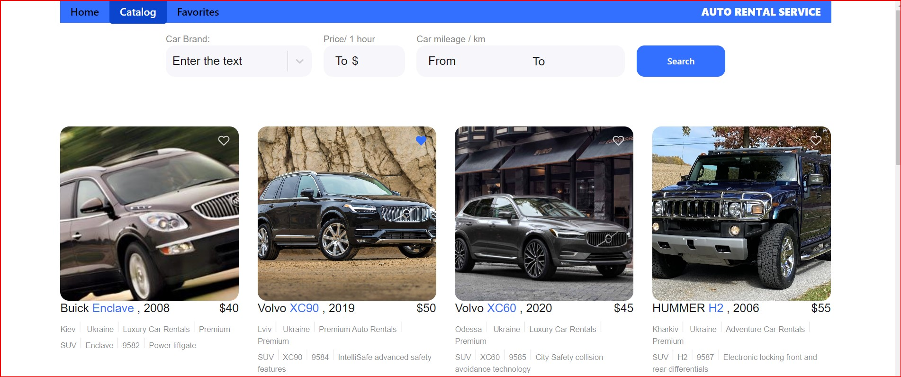
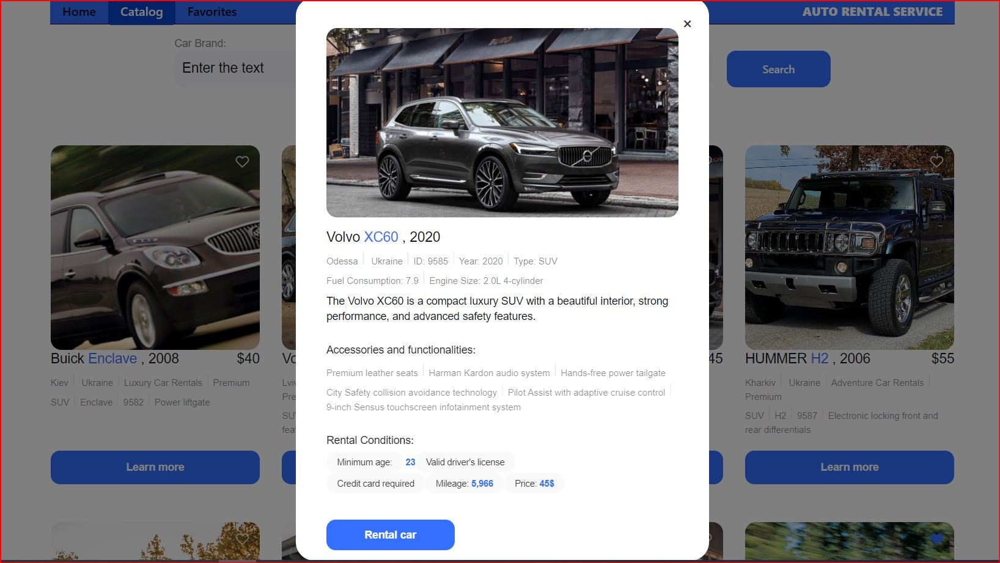
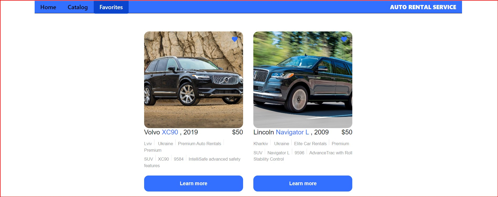

My greetings!

I would like to introduce you to the "Service auto rental" application - a car rental service.

This service allows you to browse available cars and place orders by phone with the car rental company.

The application consists of three main pages:

The home page with a general description of the services provided by the company.

A catalog page of cars with detailed information about each car, which can be filtered by brand, hourly
 rental price, and mileage.

 

A page with your selected ads that you have chosen as favorites.

At the moment, registration in the application is not required. However, in the near future, we plan to
 address this issue and also add a mobile version and store all information in a database on the server,
  which will allow the application to be used on different devices.

Technologies used: 
Frontend:

- HTML/CSS,
- JS,
- React,
- Axios.

Backend:

- MockAPI.