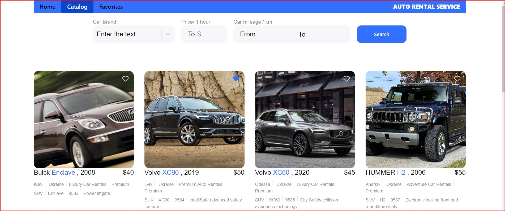
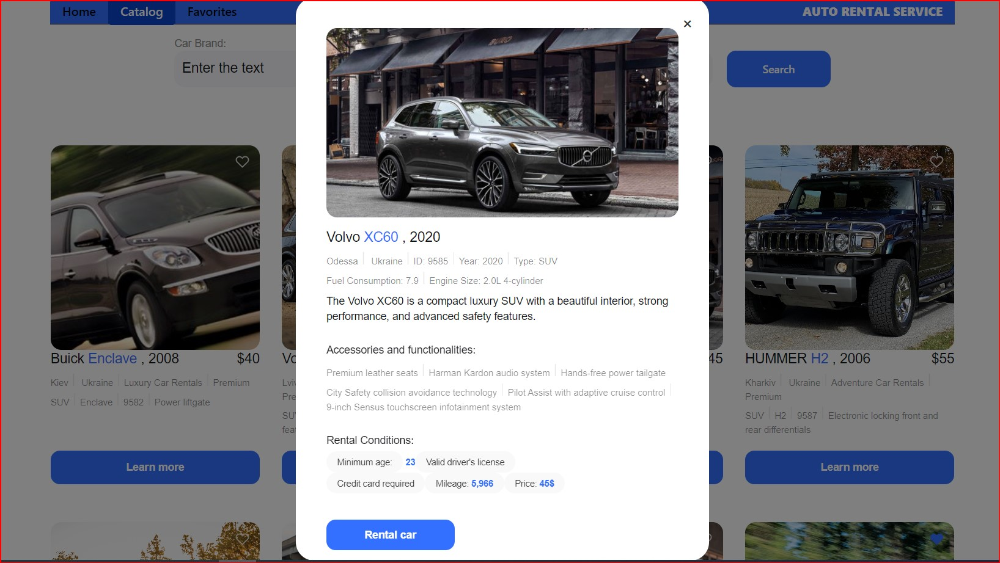
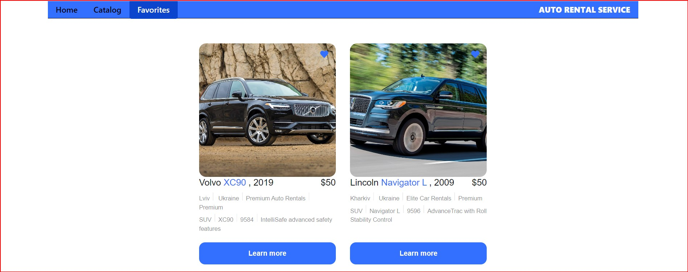

Мої вітання!

Хочу представити вам застосунок "Service auto rental" - сервіс прокату автомобілів.

Цей сервіс дозволяє переглядати доступні автомобілі та здійснювати замовлення за телефоном у компанії з
 прокату автомобілів.

Додаток складається з трьох основних сторінок:

Домашня сторінка з загальним описом послуг, які надає компанія.

Сторінка каталогу автомобілів з докладною інформацією про кожен автомобіль, яку можна фільтрувати за 
брендом, погодинною ціною оренди та пробігом.

Сторінка з обраними вами оголошеннями, які ви вибрали як улюблені.

На даний момент реєстрація в додатку не передбачена. Проте, найближчим часом планується вирішити це питання,
 а також додати мобільну версію і зберігання усієї інформації в базі даних на сервері, що дозволить
  використовувати застосунок на різних пристроях.

Використані технології :
Frontend:

- HTML/CSS,
- JS,
- React,
- Axios.

Backend:

- MockAPI.